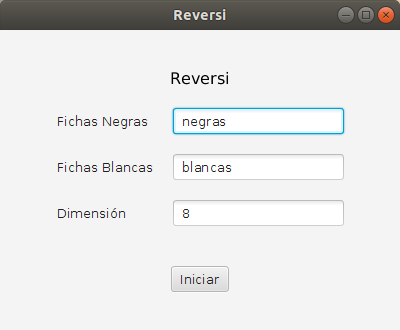
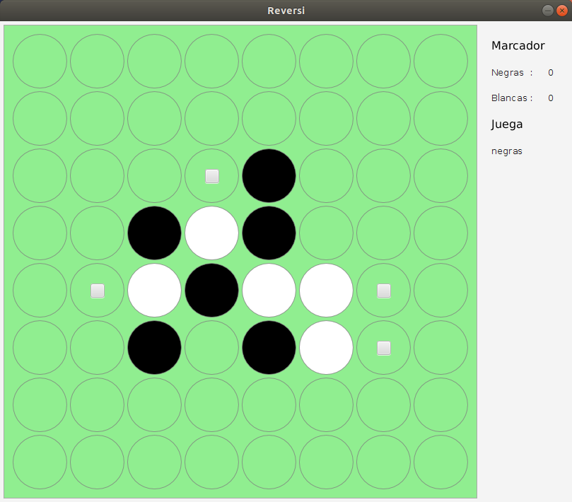

UNTreF - Algoritmos y Programación 1

# Trabajo Práctico: Reversi

## Problema

Completar el desarrollo de la aplicación Reversi.

### Referencias

 https://es.wikipedia.org/wiki/Reversi
 
 https://es.wikihow.com/jugar-a-Othello

## Enunciado

Implementar la clase `Reversi` a partir de la siguiente especificación: 

[`Reversi.java`](./src/juego/Reversi.java).

[`Casillero.java`](./src/juego/Casillero.java)

### Pantallas

## Condiciones

El siguiente trabajo debe realizarse o en grupos de a lo sumo 3 personas, 
no se admitirán bajo ningún concepto entregas individuales o de grupos formados por 4 o más personas.

Los docentes usarán su propia baterí­a de pruebas (que respetan la misma interfaz, 
por lo que no deberán cambiar la firma de sus métodos públicos de la clase `Reversi`).

En función a las pruebas que pasen, se asignará una nota al trabajo. 

También serán tenidos en cuenta aquellos trabajos que mejoren la gráfica de la aplicación.

El 60% de las pruebas garantiza la aprobación.

## Pruebas Unitarias

Se deben entregar pruebas unitarias intensivas de la clase desarrollada.

